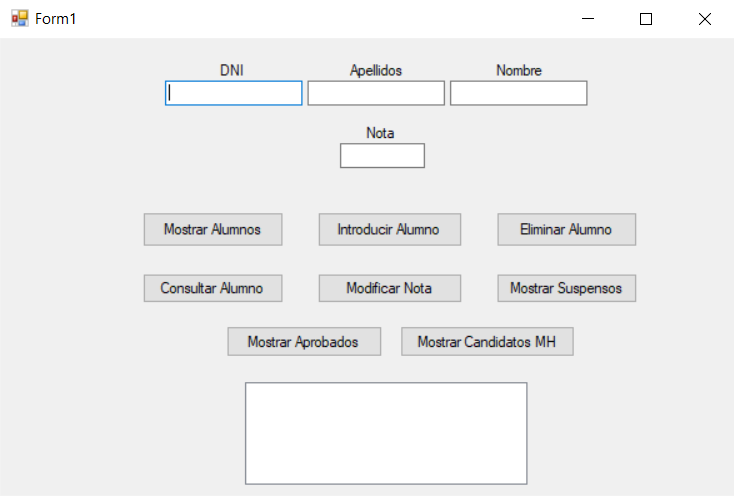

# Sistema de Gestión de Calificaciones de Alumnos

Este proyecto es una aplicación de escritorio desarrollada en C# con Windows Forms que permite gestionar las calificaciones de un grupo de alumnos. La aplicación cumple con los siguientes requisitos:

- **Mostrar información completa de los alumnos** (DNI, Apellidos, Nombre, Nota y Calificación).
- **Agregar nuevos alumnos** al sistema.
- **Eliminar alumnos** por DNI.
- **Consultar la nota y calificación** de un alumno por DNI.
- **Modificar la nota** de un alumno.
- **Mostrar alumnos suspensos**, aprobados y candidatos a Matrícula de Honor.
- **Calcular automáticamente la calificación** a partir de la nota numérica.

## Capturas de Pantalla

A continuación, se muestran una capturas de pantalla de la aplicación:

### Interfaz Principal



## Requisitos del Sistema

Para ejecutar este proyecto, necesitarás lo siguiente:

- **Visual Studio 2022 o superior** (Community Edition es suficiente).
- **.NET Framework 4.7.2 o superior**.

## Estructura del Proyecto

El proyecto está organizado en las siguientes clases y archivos:

1. **Clase `Persona`:**
   - Clase base que contiene los atributos comunes (`DNI`, `Apellidos`, `Nombre`).

2. **Clase `Alumno`:**
   - Hereda de `Persona` y añade atributos específicos (`Nota`, `Calificacion`).
   - Calcula automáticamente la calificación basada en la nota.

3. **Interfaz `IGestionAlumnos`:**
   - Define las operaciones que debe implementar la clase de gestión.

4. **Clase `GestionAlumnos`:**
   - Implementa la interfaz `IGestionAlumnos` y gestiona las operaciones sobre los alumnos.

5. **Formulario Principal (`Form1`):**
   - Interfaz gráfica para interactuar con el sistema.

## Instalación y Ejecución

### Clonar el Repositorio

```bash
git clone https://github.com/IvanVY/Examen-Practico-Programaci-n-Estructurada-y-Visual.git
